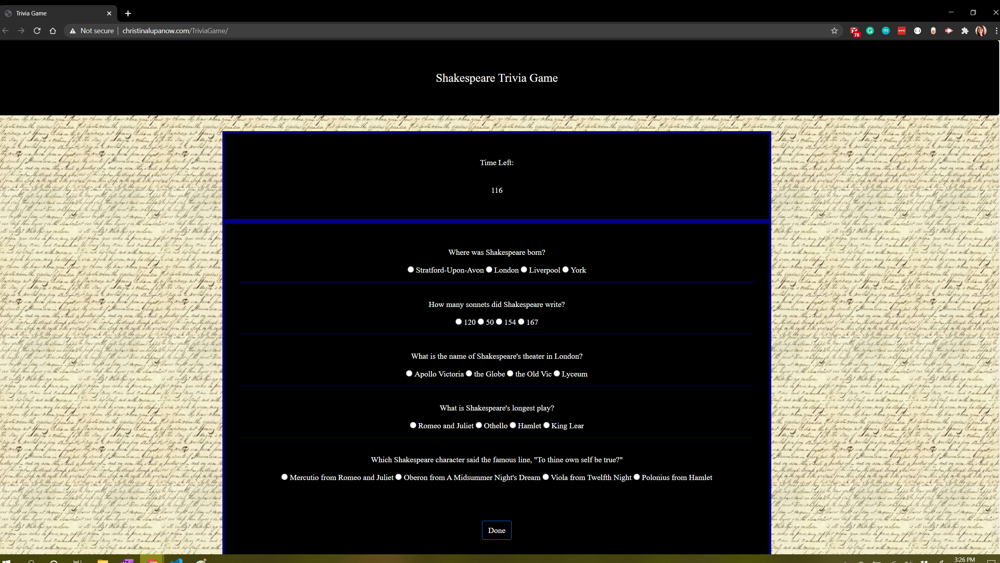

<!-- PROJECT SHIELDS -->

[![Contributors][contributors-shield]][contributors-url] [![Forks][forks-shield]][forks-url] [![Stargazers][stars-shield]][stars-url] [![Issues][issues-shield]][issues-url] [![LinkedIn][linkedin-shield]][linkedin-url]

 
<h3 align="center">Trivia Game</h3>
<p align="center">
This application uses basic JavaScript to build a trivia game that is timed and keeps track of how many questions are correct, incorrect, or unanswered.
<br />
<br />
<a href="https://celupanow.github.io/TriviaGame">View Demo</a>
·
<a href="https://github.com/celupanow/TriviaGame/issues">Report Bug</a>
·
<a href="https://github.com/celupanow/TriviaGame/issues">Request Feature</a>

</p>

</p>
<!-- TABLE OF CONTENTS -->

## Table of Contents

* [About the Project](#about-the-project)
	* [Built With](#built-with)
* [Getting Started](#getting-started)
	* [Prerequisites](#prerequisites)
	* [Installation](#installation)
* [Roadmap](#roadmap)
* [Contact](#contact)
* [Acknowledgements](#acknowledgements)

  
  
  

<!-- ABOUT THE PROJECT -->

## About The Project


### Built With
* [HTML](https://developer.mozilla.org/en-US/docs/Learn/HTML)
* [CSS](https://developer.mozilla.org/en-US/docs/Web/CSS)
* [Bootstrap](https://getbootstrap.com/)
* [Javascript](https://developer.mozilla.org/en-US/docs/Web/JavaScript)

<!-- GETTING STARTED -->

## Getting Started
To get a local copy up and running follow these simple steps.
  
### Installation

1. Clone the repo

```sh

git clone https://github.com/celupanow/TriviaGame.git

```
2. Open index.html in your browser

<!-- ROADMAP -->

## Roadmap

  

See the [open issues](https://github.com/celupanow/TriviaGame/issues) for a list of proposed features (and known issues).

<!-- CONTACT -->

## Contact

  

Christina Lupanow - christina@christinalupanow.com

  
Project Link: [https://github.com/celupanow/TriviaGame](https://github.com/celupanow/TriviaGame)

<!-- ACKNOWLEDGEMENTS -->

## Acknowledgements

* [GitHub Pages](https://pages.github.com)

<!-- MARKDOWN LINKS & IMAGES -->

<!-- https://www.markdownguide.org/basic-syntax/#reference-style-links -->

[contributors-shield]: https://img.shields.io/github/contributors/celupanow/TriviaGame.svg?style=flat-square

[contributors-url]: https://github.com/celupanow/TriviaGame/graphs/contributors

[forks-shield]: https://img.shields.io/github/forks/celupanow/TriviaGame.svg?style=flat-square

[forks-url]: https://github.com/celupanow/TriviaGame/network/members

[stars-shield]: https://img.shields.io/github/stars/celupanow/TriviaGame.svg?style=flat-square

[stars-url]: https://github.com/celupanow/TriviaGame/stargazers

[issues-shield]: https://img.shields.io/github/issues/celupanow/TriviaGame.svg?style=flat-square

[issues-url]: https://github.com/celupanow/TriviaGame/issues

[license-shield]: https://img.shields.io/github/license/celupanow/TriviaGame.svg?style=flat-square

[license-url]: https://github.com/celupanow/TriviaGame/blob/master/LICENSE.txt

[linkedin-shield]: https://img.shields.io/badge/-LinkedIn-black.svg?style=flat-square&logo=linkedin&colorB=555

[linkedin-url]: https://www.linkedin.com/in/christinalupanow

[product-screenshot]: images/screenshot.png
<!--stackedit_data:
eyJoaXN0b3J5IjpbLTg2MjgzNDc1OCwtMTMyNTI1NTUxMiwxND
k3MjI2ODM3XX0=
-->